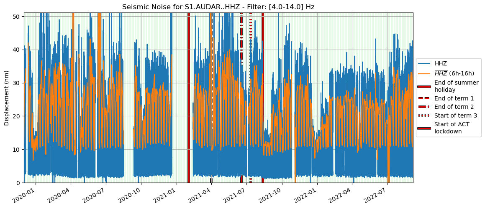
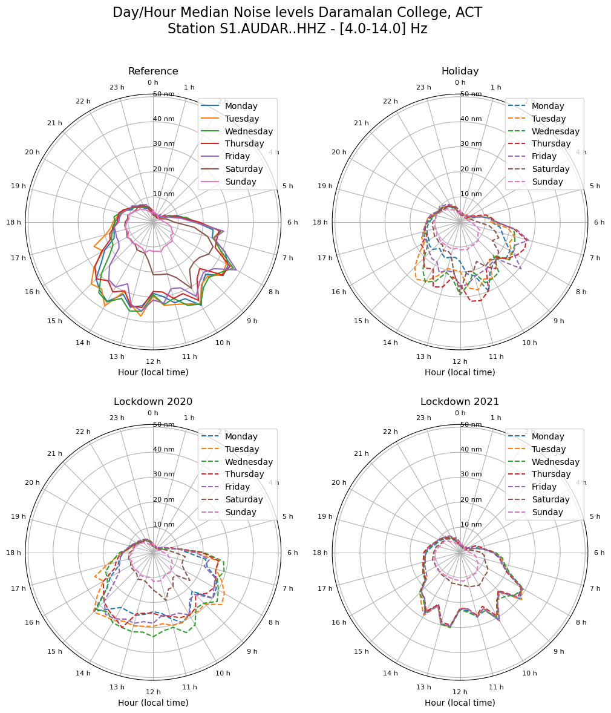

<!-- #region -->
# Ground Motion Displacement RMS vs Time

This repository is a self-updating version of the [seismic social-distancing "monitoring" toolkit](https://github.com/ThomasLecocq/SeismoRMS) of Thomas Lecocq, Fred Massin, and Claudio Satriano that was designed to show the effect on seismic noise of stay-at-home orders for the COVID19 emergency. The notebook software is bundled with some code to trigger github actions to download any new data and update the images in this README file.

This example is from the Daramalan College in ACT, Australia - part of the Australian Seismometers in Schools network. 

If you want to try it, fork the template repository and follow the [instructions below](#Help)
<!-- #endregion -->

## Classic plot

## Hourly plot

## Health checker 

Verify that the daily data is complete and monitor the updates from [this plot](results/latest-gridmap.png). If days are incomplete, try deleting the .npz file that is cached and it will be rebuilt when you run the notebook locally or when the scheduled job re-runs (assuming the data are available on the server).

## Tabulated results

The [tabulated output](results/latest.csv) of the run is also available.

## Help

For more information, refer to the template / master repository at https://github.com/ANU-RSES-Education/SeismicNoise_AuSIS

